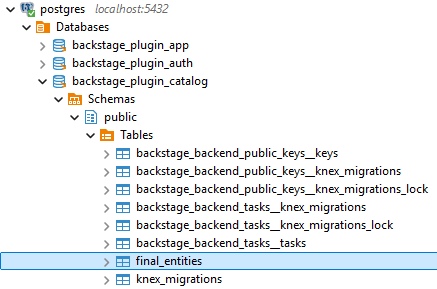

# Backstage self-study

## create-app

On WSL terminal:

```bash
# Install Node Version Manager
curl -o- https://raw.githubusercontent.com/nvm-sh/nvm/v0.39.1/install.sh | bash
source ~/.bashrc

nvm -v

# Install NodeJS
nvm install v18
nvm use global v18

node -v
npm -v

# Install Yarn
npm install --global yarn

yarn -v

# Create Backstage app
npx @backstage/create-app@latest
```

```bash
cd my-portal/

git init
git add .
```

## Commands

```bash
# Start frontend (port 3000)
yarn workspace app start

# Start backend (port 7007)
yarn workspace backend start

# Start frontend+backend
yarn start
```

## Backend Endpoints

```
http://localhost:7007/.backstage/health/v1/liveness
http://localhost:7007/.backstage/health/v1/readiness

http://localhost:7007/api/catalog/entities
http://localhost:7007/api/catalog/entities/by-query?filter=kind=component,metadata.name=my-portal
```

## GitHub OAuth app for authentication

<table>
    <tr><td><b>Application name</b></td><td>my-portal-oauth-app</td></tr>
    <tr><td><b>Homepage URL</b></td><td>http://localhost:3000</td></tr>
    <tr><td><b>Authorization callback URL</b></td><td>http://localhost:7007/api/auth/github/handler/frame</td></tr>
</table>

## GitHub Personal Access Token (PAT) for Github Integration

At least the `repo` scope is nedded for reading components into the Software Catalog.

## Dependency installation commands

```bash
yarn --cwd packages/backend add @backstage/plugin-auth-backend-module-github-provider
yarn --cwd packages/backend add @backstage/plugin-catalog-backend-module-github
```

## Command to run PostgreSQL locally

```bash
docker run -d --name postgres --restart=always -p 5432:5432 -e POSTGRES_USER=<username> -e POSTGRES_PASSWORD=<password> postgres:17.0-bookworm
```

## Viewing catalog entities in the database after connecting to PostgreSQL

The catalog entities can be seen in the `backstage_plugin_catalog` database:



An example query:

```sql
SELECT * FROM final_entities
WHERE entity_ref = 'component:default/my-portal'
```

## How to

- [Configure a service](https://github.com/lucasduartems/backstage-self-study/commit/4807079278a8fdbb1fa1624f16b926d80166f757)
- [Set up GitHub authentication](https://github.com/lucasduartems/backstage-self-study/commit/4caca5b1ed99e33e245833d325b376184f29e3fa)
- [Set up GitHub integration with discovery of catalog entities](https://github.com/lucasduartems/backstage-self-study/commit/e3b474161335539fea487cfd5a2eb4895422a6b3)
- [Use API refs in the frontend](https://github.com/lucasduartems/backstage-self-study/commit/85dbbe86c5c039eb39acbfff4714ffe5527efd58)
- [Connect to PostgreSQL](https://github.com/lucasduartems/backstage-self-study/commit/e10880ac2d1a9a1d19fa1a1f272b520752802be4)
- [Display OpenAPI definition](https://github.com/lucasduartems/backstage-self-study/commit/e81be94f2ff5a8ae3f5c0549fddf75c98ef4faba)


## References

- [The Ultimate Backstage Guide (2024 Version) - Backstage with OrkoHunter (Tutorial)](https://youtu.be/r46uFbu9wOs?si=W5Wj4WZKi1sdNvNq)
- [Backstage docs](https://backstage.io/docs)